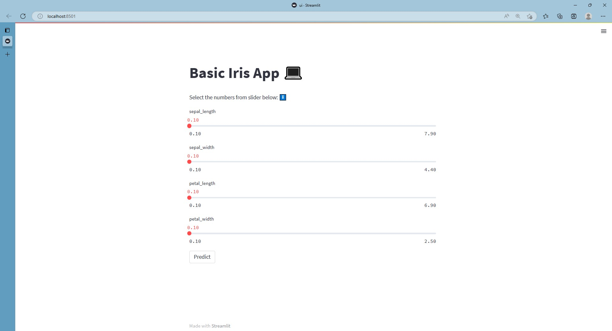

# ML application Implementation 🚀

## Using module
- FastAPI
- streamlit
- sklearn
## Setup model
the setup model script is prvided from [test_model](./test_model.ipynb)
## Starting App
1. 
```python
uvicorn fast_api:app --reload
```
2.
```python
streamlit run ui.py
```
## Result

